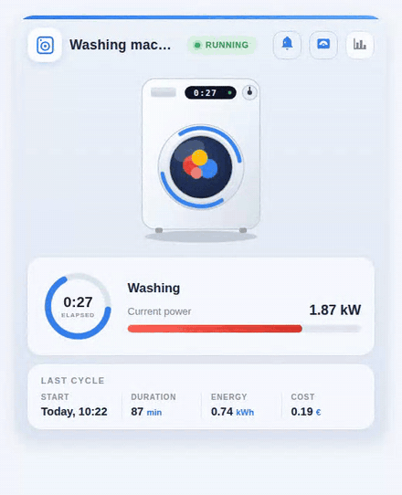

# 🧺 Washing Machine Animated Card for Home Assistant

**English** | [Русский](README_RU.md)

An Oikos-inspired Lovelace card that turns a *dumb* washing machine on a smart plug into a beautiful, animated dashboard widget — no smart washer required.



<sub>Russian UI demo (recorded on a real dashboard): [media/demo.gif](media/demo.gif) · [media/demo.mp4](media/demo.mp4)</sub>

## ✨ Features

- **Animated machine illustration** — while a cycle is running, the laundry tumbles behind the glass, blue arcs spin around the door (one turn per 3 s) and the on-machine display shows the elapsed time. All animation is pure CSS/SVG, no external assets, and it respects `prefers-reduced-motion`.
- **Live status** — a pulsing "RUNNING / IDLE" badge, an elapsed-time progress ring and a power gauge with automatic unit handling (`1950 W` is shown as `1.95 kW`; an ampere sensor is labelled "Current draw" automatically).
- **Last cycle summary** — start time ("Today, 09:55"), duration, energy and cost, each column tappable for more-info.
- **Quick actions** — header buttons toggle the smart plug and the finish-notification automation, and open the power history.
- **Bilingual** — English and Russian labels out of the box; the language follows your Home Assistant profile, or set `language: en | ru` explicitly.
- **Zero dependencies** — a single vanilla-JS file with Shadow DOM. Every entity option except `status_entity` is optional: blocks without an entity are simply hidden. Responsive via CSS container queries.

## 📦 Installation

### Manual

1. Copy [`washing-machine-card.js`](washing-machine-card.js) to `/config/www/`.
2. Add a dashboard resource (Settings → Dashboards → Resources, or `lovelace: resources:` in YAML mode):

   ```yaml
   url: /local/washing-machine-card.js?v=1
   type: module
   ```

   Bump `?v=` after every update to bust the browser cache.

### HACS

Add `https://github.com/sionetta/wm_animated_ha_card` as a **custom repository** (type: Dashboard), then install *Washing Machine Animated Card*.

## ⚙️ Configuration

```yaml
type: custom:washing-machine-card
name: Washing machine
status_entity: binary_sensor.washing_in_progress   # REQUIRED
plug_entity: switch.washing_machine_plug           # plug button, tap = toggle
notify_entity: automation.washing_finished         # notification button, tap = toggle
power_entity: sensor.washing_machine_power         # gauge + running detection
power_threshold: 10                                # running above this value
power_max: 2500                                    # gauge maximum
last_wash_entity: input_datetime.wm_last_start     # cycle start timestamp
duration_entity: input_number.wm_last_duration     # cycle duration, minutes
energy_entity: input_number.wm_last_energy         # kWh per cycle
cost_entity: input_number.wm_last_cost             # cost per cycle
currency: "€"
language: en                                       # en / ru (default: HA language)
```

| Option | Required | Default | Description |
|---|---|---|---|
| `status_entity` | **yes** | — | Entity whose state marks a running cycle. A template `binary_sensor` on the plug's power/current works great; textual states (`washing`, `spin`, …) are matched via `running_states`. |
| `name` | no | localized | Card title. |
| `plug_entity` | no | — | Smart plug switch; shown as a header button, tap toggles it. |
| `notify_entity` | no | — | Automation/switch/input_boolean for the "cycle finished" notification; tap toggles it. |
| `power_entity` | no | — | Power (W) or current (A) sensor: red gauge, value display and a second "running" detector. |
| `power_threshold` | no | `10` | Above this value the machine counts as running. |
| `power_max` | no | `2500` | Gauge maximum, in `power_entity` units. |
| `last_wash_entity` | no | — | `input_datetime` with the cycle start; also the source of the elapsed time. |
| `duration_entity` | no | — | Last cycle duration in minutes. |
| `energy_entity` | no | — | Energy per cycle, kWh. |
| `cost_entity` | no | — | Cost per cycle. |
| `currency` | no | `€` | Currency symbol for the cost column. |
| `running_states` | no | on, washing, run, spin, rinse, … | States of `status_entity` treated as "running". |
| `language` | no | HA language | `en` or `ru`. |

## 🧠 How it works with a dumb machine

The machine itself reports nothing — everything is derived from a smart plug with power monitoring:

- a template `binary_sensor` (power above a threshold, with `delay_off` of a few minutes so inter-cycle pauses don't count as "finished") drives the status;
- a small automation stores the cycle start into `input_datetime`, and on finish writes duration, energy and cost into `input_number` helpers which the card displays as the "Last cycle" panel.

An example Home Assistant package with these sensors, helpers and automations is in [`examples/`](examples/).

## 📄 License

[MIT](LICENSE) © 2026 [sionetta](https://github.com/sionetta)
