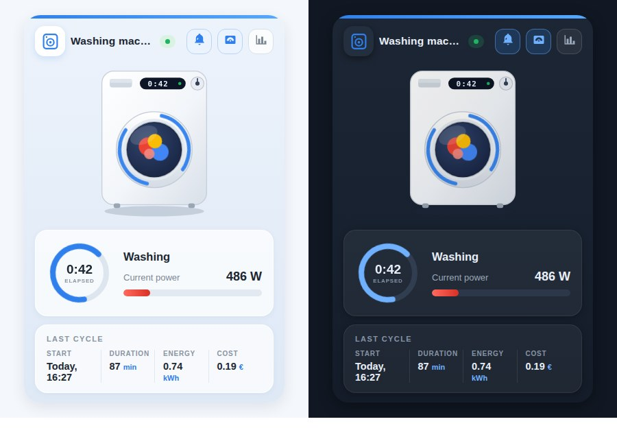

# 🏠 Animated Appliance Card for Home Assistant

**English** | [Русский](README_RU.md) | [Deutsch](README_DE.md) | [Français](README_FR.md)

An Oikos-inspired Lovelace card that turns a *dumb* washer, dryer, dishwasher, oven or microwave on a smart plug into a beautiful, animated dashboard widget — no smart appliance required.


<sub>Same card in other UI languages: [Русский](media/demo_ru.gif) · [Deutsch](media/demo_de.gif) · [Français](media/demo_fr.gif)</sub>

## ✨ Features

- **Five appliances, one card** — `washer`, `dryer`, `dishwasher`, `oven` and `microwave`, each with its own illustration, icon and wording. Switch with a single line: `appliance_type: dryer`.
- **Animated while running** — laundry tumbles behind the glass, dishwasher jets sweep, the oven glows, the microwave turntable turns. All animation is pure CSS/SVG, no external assets, and it respects `prefers-reduced-motion`.
- **Light and dark themes** — the card follows your Home Assistant theme automatically, or you can pin it with `theme: light | dark`.
- **Live status** — a pulsing "RUNNING / IDLE" badge, an elapsed-time ring and a power gauge with automatic unit handling (`1950 W` is shown as `1.95 kW`; an ampere sensor is labelled "Current draw" automatically).
- **Last cycle summary** — start time ("Today, 09:55"), duration, energy and cost, each column tappable for more-info.
- **Quick actions** — header buttons toggle the smart plug and the finish-notification automation, and open the power history.
- **Four languages** — English, Russian, German and French labels out of the box. The language follows your Home Assistant profile, or set `language: en | ru | de | fr` explicitly.
- **Visual editor** — the card ships a config form, so it can be set up from the UI without touching YAML.
- **Zero dependencies** — a single vanilla-JS file with Shadow DOM. Every entity option except `status_entity` is optional: blocks without an entity are simply hidden. Responsive via CSS container queries.

## 🌗 Light and dark



`theme: auto` (the default) follows Home Assistant: switch your dashboard to a dark theme and the card follows on the next render. `theme: light` and `theme: dark` pin it regardless of the dashboard.

## 📦 Installation

Two steps: first the card itself, then the entities it displays.

### Step 1 — the card

**Manual**

1. Copy [`washing-machine-card.js`](washing-machine-card.js) to `/config/www/`.
2. Add a dashboard resource (Settings → Dashboards → Resources, or `lovelace: resources:` in YAML mode):

   ```yaml
   url: /local/washing-machine-card.js?v=4
   type: module
   ```

   Bump `?v=` after every update to bust the browser cache.

**HACS**

Add `https://github.com/sionetta/wm_animated_ha_card` as a **custom repository** (type: Dashboard), then install *Washing Machine Animated Card*.

### Step 2 — the appliance entities

The card only displays data, and `status_entity` is required, so this step cannot be skipped.

**A smart appliance** (Home Connect, Miele@home, LG ThinQ, SmartHQ) already reports its own state — go straight to "Using it with a smart appliance" below.

**An ordinary appliance on a smart plug** — the ready-made package creates everything:

1. Find your plug's sensors in Developer tools → States: power (W) and cumulative energy (kWh), e.g. `sensor.washer_plug_power` and `sensor.washer_plug_energy`.

2. Enable packages in `configuration.yaml` (if a `homeassistant:` block already exists, add the line to it):

   ```yaml
   homeassistant:
     packages: !include_dir_named packages
   ```

3. Copy [`examples/washing_machine_package.yaml`](examples/washing_machine_package.yaml) to `/config/packages/washing_machine.yaml`.

4. Replace `sensor.YOUR_PLUG_power` and `sensor.YOUR_PLUG_energy` in it with your own.

5. Restart Home Assistant.

6. Set your electricity price in `input_number.el_tarif` — it defaults to zero, and without a tariff the cycle cost will always be `0.00`.

7. Check that the entities appeared:

   | Entity | Purpose |
   |---|---|
   | `binary_sensor.washing_in_progress` | for `status_entity` |
   | `input_datetime.wm_last_start` | cycle start |
   | `input_number.wm_last_duration` | duration |
   | `input_number.wm_last_energy` | energy |
   | `input_number.wm_last_cost` | cost |
   | `input_number.el_tarif` | your tariff (step 6) |
   | `input_number.wm_energy_start` | internal |

8. Add the card to your dashboard — see "Configuration" below.

> The notification arrives as a `persistent_notification`. For your phone, replace the last block of the automation with your own `notify.mobile_app_...`.
>
> For a dryer, dishwasher, oven or microwave, copy the package under a different name with different entity prefixes, and set the matching `appliance_type` on the card.
>
> Without packages: the same helpers can be created in the Home Assistant UI, and the automations pasted into the automation editor (⋮ → Edit in YAML).

## ⚙️ Configuration

```yaml
type: custom:washing-machine-card
appliance_type: washer                             # washer | dryer | dishwasher | oven | microwave
name: Washing machine
status_entity: binary_sensor.washing_in_progress   # REQUIRED
plug_entity: switch.washing_machine_plug           # plug button, tap = toggle
notify_entity: automation.washing_finished         # notification button, tap = toggle
power_entity: sensor.washing_machine_power         # gauge + running detection
power_threshold: 10                                # running above this value
power_max: 2500                                    # gauge maximum
last_wash_entity: input_datetime.wm_last_start     # cycle start timestamp
duration_entity: input_number.wm_last_duration     # cycle duration, minutes
energy_entity: input_number.wm_last_energy         # kWh per cycle
cost_entity: input_number.wm_last_cost             # cost per cycle
hide_status_panel: true                            # Hide status panel only when idle (Default: false)
currency: "€"
language: en                                       # en / ru / de / fr (default: HA language)
theme: auto                                        # auto / light / dark
```

| Option | Required | Default | Description |
|---|---|---|---|
| `status_entity` | **yes** | — | Entity whose state marks a running cycle. A template `binary_sensor` on the plug's power/current works great; textual states (`washing`, `spin`, …) are matched via `running_states`. |
| `appliance_type` | no | `washer` | Visual + labels: `washer`, `dryer` (alias `tumbler`), `dishwasher`, `oven` or `microwave`. |
| `name` | no | localized | Card title (defaults depend on `appliance_type`). |
| `plug_entity` | no | — | Smart plug switch; shown as a header button, tap toggles it. |
| `notify_entity` | no | — | Automation/switch/input_boolean for the "cycle finished" notification; tap toggles it. |
| `power_entity` | no | — | Power (W) or current (A) sensor: red gauge, value display and a second "running" detector. |
| `power_threshold` | no | `10` | Above this value the appliance counts as running. |
| `power_max` | no | `2500` | Gauge maximum, in `power_entity` units. |
| `last_wash_entity` | no | — | `input_datetime` with the cycle start; also the source of the elapsed time. |
| `duration_entity` | no | — | Last cycle duration in minutes. |
| `energy_entity` | no | — | Energy per cycle, kWh. |
| `cost_entity` | no | — | Cost per cycle. |
| `currency` | no | `€` | Currency symbol for the cost column. |
| `running_states` | no | on, washing, run, spin, rinse, … | States of `status_entity` treated as "running" (English, Russian, German and French states are recognised). |
| `hide_status_panel` | no | false | Hide status panel only when idle. |
| `language` | no | HA language | `en`, `ru`, `de` or `fr`. |
| `theme` | no | `auto` | `auto` follows the Home Assistant theme, `light` and `dark` pin it. |

## 🧺 Appliance types

| `appliance_type` | Default title | Running label |
|---|---|---|
| `washer` | Washing machine | Washing |
| `dryer` (alias `tumbler`) | Dryer | Drying |
| `dishwasher` | Dishwasher | Washing dishes |
| `oven` | Oven | Baking |
| `microwave` | Microwave | Heating |

Titles and labels are translated into all four languages; `name` overrides the title.

## 🧠 How it works with a dumb appliance

The appliance itself reports nothing — everything is derived from a smart plug with power monitoring:

- a template `binary_sensor` (power above a threshold, with `delay_off` of a few minutes so inter-cycle pauses don't count as "finished") drives the status;
- a small automation stores the cycle start into `input_datetime`, and on finish writes duration, energy and cost into `input_number` helpers which the card displays as the "Last cycle" panel.

The ready-made package that creates all of this is installed in step 2 above.

## 🔌 Using it with a smart appliance

If your appliance already reports its own state, you don't need the plug or any of the
helpers. Home Connect (Bosch / Siemens / Neff / Gaggenau), Miele@home, LG ThinQ and
SmartHQ all expose an operation state entity, so `status_entity` can point straight at it:

```yaml
type: custom:washing-machine-card
appliance_type: washer
status_entity: sensor.washer_operation_state
plug_entity: switch.washer_power
running_states: [run]
```

A dryer, dishwasher, oven or microwave is the same config with a different
`appliance_type` and entity prefix. Narrow `running_states` to the one state that
really means "running", otherwise a paused or powered-but-idle appliance reads as running.

[`examples/smart_appliance.yaml`](examples/smart_appliance.yaml) has the full version,
including the progress, finish time and door values the card has no options for, plus
notes on what stays empty and why.

## 📝 Changelog

See [CHANGELOG.md](CHANGELOG.md) for the release history.

## 📄 License

[MIT](LICENSE) © 2026 [sionetta](https://github.com/sionetta)
