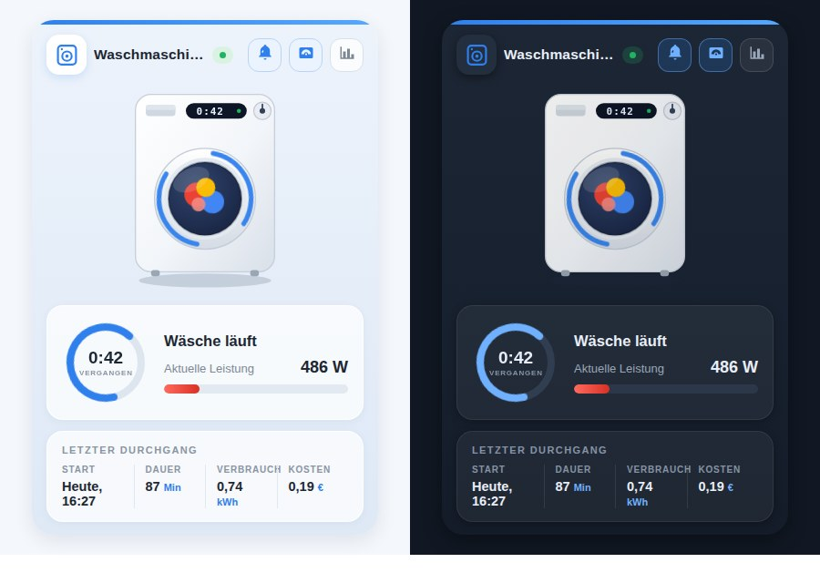

# 🏠 Animierte Gerätekarte für Home Assistant

[English](README.md) | [Русский](README_RU.md) | **Deutsch** | [Français](README_FR.md)

Eine Oikos-inspirierte Lovelace-Karte, die aus einer *nicht smarten* Waschmaschine, einem Trockner, Geschirrspüler, Backofen oder einer Mikrowelle an einer schaltbaren Steckdose ein schönes, animiertes Dashboard-Widget macht — ganz ohne smartes Gerät.


<sub>Dieselbe Karte in anderen Oberflächensprachen: [English](media/demo_en.gif) · [Русский](media/demo_ru.gif) · [Français](media/demo_fr.gif)</sub>

## ✨ Funktionen

- **Fünf Geräte, eine Karte** – `washer`, `dryer`, `dishwasher`, `oven` und `microwave`, jedes mit eigener Illustration, eigenem Icon und eigenen Texten. Umschalten mit einer Zeile: `appliance_type: dryer`.
- **Animation im Betrieb** – die Wäsche dreht sich hinter dem Bullauge, im Geschirrspüler schwenkt der Sprüharm, der Backofen glüht, in der Mikrowelle dreht sich der Teller. Alles reines CSS und SVG, ohne externe Dateien, und `prefers-reduced-motion` wird berücksichtigt.
- **Helles und dunkles Design** – die Karte folgt automatisch dem Home-Assistant-Theme oder wird mit `theme: light | dark` festgelegt.
- **Live-Status** – ein pulsierendes „LÄUFT / BEREIT“-Badge, ein Ring mit der verstrichenen Zeit und eine Leistungsanzeige, die die Einheit selbst wählt (`1950 W` erscheint als `1,95 kW`; hängt ein Stromsensor dran, heißt die Beschriftung automatisch „Stromaufnahme“).
- **Letzter Durchgang** – Startzeit („Heute, 09:55“), Dauer, Verbrauch und Kosten. Jede Spalte öffnet per Tippen den More-Info-Dialog.
- **Schnellzugriffe** – Buttons in der Kopfzeile schalten die Steckdose und die Benachrichtigungs-Automatisierung und öffnen den Leistungsverlauf.
- **Vier Sprachen** – Deutsch, Englisch, Russisch und Französisch von Haus aus. Die Sprache folgt deinem Home-Assistant-Profil oder wird mit `language: de | en | ru | fr` fest gesetzt.
- **Visueller Editor** – die Karte liefert ein Konfigurationsformular mit, lässt sich also ohne YAML über die Oberfläche einrichten.
- **Keine Abhängigkeiten** – eine einzige Vanilla-JS-Datei mit Shadow DOM. Alle Entity-Optionen außer `status_entity` sind optional, Blöcke ohne Entity werden einfach ausgeblendet. Responsiv über CSS Container Queries.

## 🌗 Hell und dunkel



`theme: auto` (Standard) folgt Home Assistant: Stellst du dein Dashboard auf ein dunkles Theme um, zieht die Karte beim nächsten Rendern nach. `light` und `dark` legen das Aussehen unabhängig vom Dashboard fest.

## 📦 Installation

### Manuell

1. Kopiere [`washing-machine-card.js`](washing-machine-card.js) nach `/config/www/`.
2. Füge eine Dashboard-Ressource hinzu (Einstellungen → Dashboards → Ressourcen oder `lovelace: resources:` im YAML-Modus):

   ```yaml
   url: /local/washing-machine-card.js?v=3
   type: module
   ```

   Zähle `?v=` nach jedem Update hoch, damit der Browser die neue Datei lädt und nicht die alte aus dem Cache.

### HACS

Füge `https://github.com/sionetta/wm_animated_ha_card` als **benutzerdefiniertes Repository** hinzu (Typ: Dashboard) und installiere *Washing Machine Animated Card*.

## ⚙️ Konfiguration

```yaml
type: custom:washing-machine-card
appliance_type: washer                             # washer | dryer | dishwasher | oven | microwave
name: Waschmaschine
status_entity: binary_sensor.washing_in_progress   # PFLICHT
plug_entity: switch.washing_machine_plug           # Steckdosen-Button, Tippen schaltet um
notify_entity: automation.washing_finished         # Benachrichtigungs-Button, Tippen schaltet um
power_entity: sensor.washing_machine_power         # Anzeige + Laufterkennung
power_threshold: 10                                # darüber gilt das Gerät als laufend
power_max: 2500                                    # Maximum der Anzeige
last_wash_entity: input_datetime.wm_last_start     # Startzeitpunkt des Durchgangs
duration_entity: input_number.wm_last_duration     # Dauer des Durchgangs, Minuten
energy_entity: input_number.wm_last_energy         # kWh pro Durchgang
cost_entity: input_number.wm_last_cost             # Kosten pro Durchgang
hide_status_panel: true                            # Statusanzeige nur ausblenden, wenn inaktiv (Standard: false)
currency: "€"
language: de                                       # de / en / ru / fr (Standard: HA-Sprache)
theme: auto                                        # auto / light / dark
```

| Option | Pflicht | Standard | Beschreibung |
|---|---|---|---|
| `status_entity` | **ja** | – | Entity, deren Zustand einen laufenden Durchgang kennzeichnet. Ein Template-`binary_sensor` auf Leistung oder Strom der Steckdose eignet sich am besten. Textzustände (`washing`, `schleudern`, …) werden über `running_states` erkannt. |
| `appliance_type` | nein | `washer` | Optik + Texte: `washer`, `dryer` (Alias `tumbler`), `dishwasher`, `oven` oder `microwave`. |
| `name` | nein | übersetzt | Titel der Karte (Default hängt von `appliance_type` ab). |
| `plug_entity` | nein | – | Schalter der Steckdose. Erscheint als Button in der Kopfzeile, Tippen schaltet um. |
| `notify_entity` | nein | – | Automatisierung, `switch` oder `input_boolean` für die Benachrichtigung „Durchgang beendet“. Tippen schaltet um. |
| `power_entity` | nein | – | Sensor für Leistung (W) oder Strom (A): rote Skala, Wertanzeige, und er erkennt zusätzlich, ob das Gerät läuft. |
| `power_threshold` | nein | `10` | Oberhalb dieses Werts gilt das Gerät als laufend. |
| `power_max` | nein | `2500` | Maximum der Skala, in Einheiten von `power_entity`. |
| `last_wash_entity` | nein | – | `input_datetime` mit dem Start des Durchgangs; daraus wird auch die verstrichene Zeit berechnet. |
| `duration_entity` | nein | – | Dauer des letzten Durchgangs in Minuten. |
| `energy_entity` | nein | – | Energie pro Durchgang, kWh. |
| `cost_entity` | nein | – | Kosten pro Durchgang. |
| `currency` | nein | `€` | Währungssymbol für die Kostenspalte. |
| `running_states` | nein | on, washing, waschen, run, schleudern, … | Zustände von `status_entity`, die als „laufend“ gelten (deutsche, englische, russische und französische Zustände werden erkannt). |
| `hide_status_panel` | nein | false | Statusanzeige nur ausblenden, wenn inaktiv. |
| `language` | nein | HA-Sprache | `de`, `en`, `ru` oder `fr`. |
| `theme` | nein | `auto` | `auto` folgt dem Home-Assistant-Theme, `light` und `dark` legen es fest. |

## 🧺 Gerätetypen

| `appliance_type` | Standardtitel | Text im Betrieb |
|---|---|---|
| `washer` | Waschmaschine | Wäsche läuft |
| `dryer` (Alias `tumbler`) | Tumbler | Trocknet |
| `dishwasher` | Geschirrspüler | Spült |
| `oven` | Backofen | Backt |
| `microwave` | Mikrowelle | Erwärmt |

Titel und Texte sind in alle vier Sprachen übersetzt; `name` überschreibt den Titel.

## 🧠 So funktioniert es mit einem nicht smarten Gerät

Das Gerät selbst meldet nichts – alles wird aus einer Steckdose mit Leistungsmessung abgeleitet:

- ein Template-`binary_sensor` (Leistung über einem Schwellwert, mit `delay_off` von einigen Minuten, damit Pausen innerhalb des Durchgangs nicht als „beendet“ zählen) liefert den Status;
- eine kleine Automatisierung speichert den Start des Durchgangs in `input_datetime` und schreibt am Ende Dauer, Verbrauch und Kosten in `input_number`-Helfer, die die Karte im Bereich „Letzter Durchgang“ anzeigt.

Ein fertiges Home-Assistant-Package mit diesen Sensoren, Helfern und Automatisierungen liegt in [`examples/washing_machine_package.yaml`](examples/washing_machine_package.yaml).

## 🔌 Verwendung mit einem smarten Gerät

Meldet dein Gerät seinen Zustand bereits selbst, brauchst du weder die Steckdose noch
die Helfer. Home Connect (Bosch / Siemens / Neff / Gaggenau), Miele@home, LG ThinQ und
SmartHQ stellen eine Entity für den Betriebszustand bereit, sodass `status_entity`
direkt darauf zeigen kann:

```yaml
type: custom:washing-machine-card
appliance_type: washer
status_entity: sensor.washer_operation_state
plug_entity: switch.washer_power
running_states: [run]
```

Für Trockner, Geschirrspüler, Backofen oder Mikrowelle dieselbe Config – nur
`appliance_type` und der Entity-Präfix ändern sich. `running_states` eng halten auf den
einen Zustand, der wirklich „läuft“ bedeutet, sonst gilt ein pausiertes oder nur
eingeschaltetes Gerät schon als laufend.

In [`examples/smart_appliance.yaml`](examples/smart_appliance.yaml) steht die
ausführliche Variante: dazu Fortschritt, Endzeit und Türzustand, für die die Karte
keine eigenen Optionen hat, samt Hinweisen, was leer bleibt und warum.

## 📝 Änderungsverlauf

Die Release-Historie steht in [CHANGELOG.md](CHANGELOG.md).

## 📄 Lizenz

[MIT](LICENSE) © 2026 [sionetta](https://github.com/sionetta)
