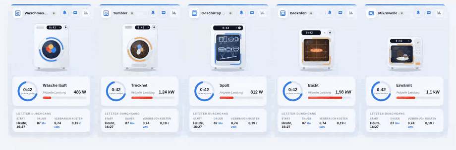

# 🧺 Animierte Waschmaschinen-Karte für Home Assistant

[English](README.md) | [Русский](README_RU.md) | **Deutsch** | [Français](README_FR.md)

Eine Oikos-inspirierte Lovelace-Karte, die aus einer *nicht smarten* Waschmaschine, Trockner, Geschirrspüler, Backofen oder Mikrowelle an einer schaltbaren Steckdose ein schönes, animiertes Dashboard-Widget macht.



<sub>Demo in anderen Oberflächensprachen: [English](media/demo_en.gif) · [Русский](media/demo.gif) · [Français](media/demo_fr.gif)</sub>

## ✨ Funktionen

- **Animierte Maschine** – während eines Durchgangs dreht sich die Wäsche hinter dem Bullauge, blaue Bögen kreisen um die Tür (eine Umdrehung alle 3 s) und das Display an der Maschine zeigt die verstrichene Zeit. Die ganze Animation ist reines CSS und SVG, ohne externe Dateien, und berücksichtigt `prefers-reduced-motion`.
- **Live-Status** – ein pulsierendes „LÄUFT / BEREIT“-Badge, ein Ring mit der verstrichenen Zeit und eine Leistungsanzeige, die die Einheit selbst wählt (`1950 W` erscheint als `1,95 kW`; hängt ein Stromsensor dran, heißt die Beschriftung automatisch „Stromaufnahme“).
- **Letzter Durchgang** – Startzeit („Heute, 09:55“), Dauer, Verbrauch und Kosten. Jede Spalte öffnet per Tippen den More-Info-Dialog.
- **Schnellzugriffe** – die Buttons in der Kopfzeile schalten Steckdose und Benachrichtigungs-Automatisierung um und öffnen den Leistungsverlauf.
- **Vier Sprachen** – Deutsch, Englisch, Russisch und Französisch von Haus aus. Die Sprache folgt deinem Home-Assistant-Profil oder wird mit `language: de | en | ru | fr` fest gesetzt.
- **Keine Abhängigkeiten** – eine einzige Vanilla-JS-Datei mit Shadow DOM. Alle Entity-Optionen außer `status_entity` sind optional, Blöcke ohne Entity werden einfach ausgeblendet. Responsiv über CSS Container Queries.

## 📦 Installation

### Manuell

1. Kopiere [`washing-machine-card.js`](washing-machine-card.js) nach `/config/www/`.
2. Füge eine Dashboard-Ressource hinzu (Einstellungen → Dashboards → Ressourcen oder `lovelace: resources:` im YAML-Modus):

   ```yaml
   url: /local/washing-machine-card.js?v=1
   type: module
   ```

   Zähle `?v=` nach jedem Update hoch, damit der Browser die neue Datei lädt und nicht die alte aus dem Cache.

### HACS

Füge `https://github.com/sionetta/wm_animated_ha_card` als **benutzerdefiniertes Repository** hinzu (Typ: Dashboard) und installiere *Washing Machine Animated Card*.

## ⚙️ Konfiguration

```yaml
type: custom:washing-machine-card
appliance_type: washer                             # washer | dryer | dishwasher | oven | microwave
name: Waschmaschine
status_entity: binary_sensor.washing_in_progress   # PFLICHT
plug_entity: switch.washing_machine_plug           # Steckdosen-Button, Tippen schaltet um
notify_entity: automation.washing_finished         # Benachrichtigungs-Button, Tippen schaltet um
power_entity: sensor.washing_machine_power         # Skala und Erkennung, ob die Maschine läuft
power_threshold: 10                                # darüber gilt die Maschine als laufend
power_max: 2500                                    # oberes Ende der Skala
last_wash_entity: input_datetime.wm_last_start     # Startzeitpunkt des Durchgangs
duration_entity: input_number.wm_last_duration     # Dauer des Durchgangs in Minuten
energy_entity: input_number.wm_last_energy         # kWh pro Durchgang
cost_entity: input_number.wm_last_cost             # Kosten pro Durchgang
currency: "€"
language: de                                       # de / en / ru / fr (Standard: HA-Sprache)
```

| Option | Pflicht | Standard | Beschreibung |
|---|---|---|---|
| `appliance_type` | nein | `washer` | Optik + Texte: `washer`, `dryer` (Alias `tumbler`), `dishwasher`, `oven` oder `microwave`. |
| `status_entity` | **ja** | – | Entity, deren Zustand einen laufenden Durchgang kennzeichnet. Ein Template-`binary_sensor` auf Leistung oder Strom der Steckdose eignet sich am besten. Textzustände (`washing`, `schleudern`, …) werden über `running_states` erkannt. |
| `name` | nein | übersetzt | Titel der Karte (Default hängt von `appliance_type` ab). |
| `plug_entity` | nein | – | Schalter der Steckdose. Erscheint als Button in der Kopfzeile, Tippen schaltet um. |
| `notify_entity` | nein | – | Automatisierung, `switch` oder `input_boolean` für die Benachrichtigung „Durchgang beendet“. Tippen schaltet um. |
| `power_entity` | nein | – | Sensor für Leistung (W) oder Strom (A): rote Skala, Wertanzeige, und er erkennt zusätzlich, ob die Maschine läuft. |
| `power_threshold` | nein | `10` | Oberhalb dieses Werts gilt die Maschine als laufend. |
| `power_max` | nein | `2500` | Oberes Ende der Skala, in der Einheit von `power_entity`. |
| `last_wash_entity` | nein | – | `input_datetime` mit dem Start des Durchgangs. Daraus wird auch die verstrichene Zeit berechnet. |
| `duration_entity` | nein | – | Dauer des letzten Durchgangs in Minuten. |
| `energy_entity` | nein | – | Verbrauch pro Durchgang in kWh. |
| `cost_entity` | nein | – | Kosten pro Durchgang. |
| `currency` | nein | `€` | Währungszeichen für die Kostenspalte. |
| `running_states` | nein | on, washing, waschen, run, schleudern, … | Zustände von `status_entity`, die als „laufend“ gelten (deutsche, englische, russische und französische Zustände werden erkannt). |
| `language` | nein | HA-Sprache | `de`, `en`, `ru` oder `fr`. |

## 🧠 So funktioniert es mit einer nicht smarten Maschine

Die Maschine selbst meldet gar nichts. Alles wird aus einer Steckdose mit Leistungsmessung abgeleitet:

- ein Template-`binary_sensor` liefert den Status. Er schaltet ein, sobald die Leistung über einem Schwellwert liegt, und hält mit `delay_off` ein paar Minuten nach, damit Pausen mitten im Durchgang nicht schon als „fertig“ zählen.
- eine kleine Automatisierung merkt sich den Start in einem `input_datetime` und schreibt am Ende Dauer, Verbrauch und Kosten in `input_number`-Helfer. Genau die zeigt die Karte im Bereich „Letzter Durchgang“.

Ein fertiges Home-Assistant-Package mit diesen Sensoren, Helfern und Automatisierungen liegt in [`examples/washing_machine_package.yaml`](examples/washing_machine_package.yaml).

## 🔌 Verwendung mit einer smarten Maschine

Wenn deine Waschmaschine oder dein Trockner den eigenen Zustand schon selbst meldet,
brauchst du weder die Steckdose noch die Helfer. Home Connect (Bosch / Siemens /
Neff / Gaggenau), Miele@home, LG ThinQ und SmartHQ stellen alle eine Entity für den
Betriebszustand bereit, `status_entity` kann also direkt darauf zeigen:

```yaml
type: custom:washing-machine-card
name: Waschmaschine
status_entity: sensor.washer_operation_state
plug_entity: switch.washer_power
running_states: [run]
```

Für einen Trockner dieselbe Config mit `appliance_type: dryer` (meist anderer
Entity-Präfix). `running_states` eng halten auf den Zustand, der wirklich
„läuft“ bedeutet — sonst wirkt eine pausierte oder nur eingeschaltete Maschine
als laufend.
Grenze `running_states` auf den einen Zustand ein, der wirklich „läuft“ bedeutet.
Sonst gilt ein Gerät, das nur pausiert oder eingeschaltet herumsteht, schon als
laufend.

In [`examples/smart_appliance.yaml`](examples/smart_appliance.yaml) steht die
ausführliche Variante: dazu Fortschritt, Endzeit und Türzustand, für die die Karte
keine eigenen Optionen hat, und Hinweise darauf, welche Bereiche in diesem Aufbau
leer bleiben und warum.

## 📄 Lizenz

[MIT](LICENSE) © 2026 [sionetta](https://github.com/sionetta)
