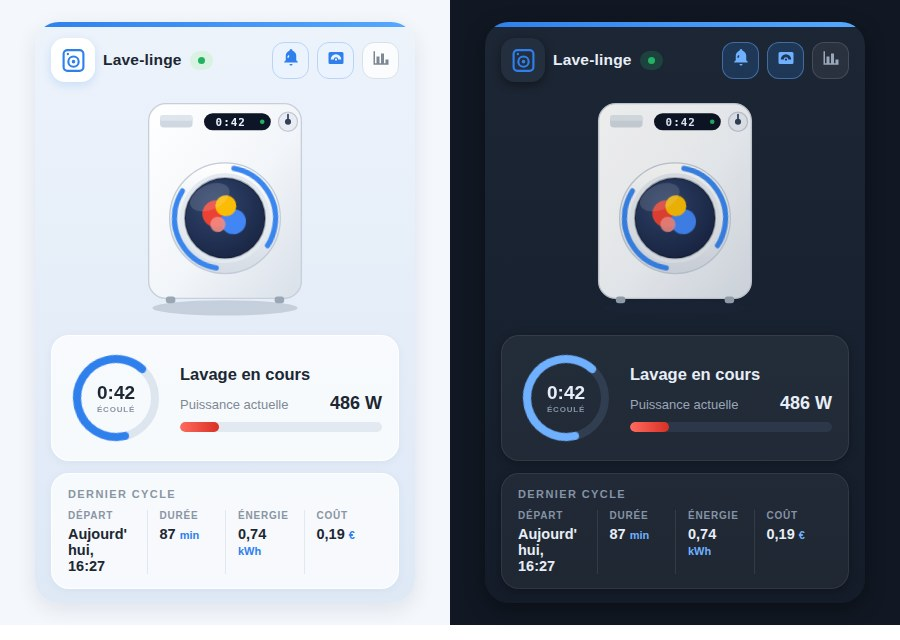

# 🏠 Carte animée d'appareil électroménager pour Home Assistant

[English](README.md) | [Русский](README_RU.md) | [Deutsch](README_DE.md) | **Français**

Une carte Lovelace inspirée d'Oikos qui transforme un lave-linge, sèche-linge, lave-vaisselle, four ou micro-ondes *ordinaire* branché sur une prise connectée en un joli widget animé — sans avoir besoin d'un appareil connecté.


<sub>La même carte dans d'autres langues d'interface : [English](media/demo_en.gif) · [Русский](media/demo_ru.gif) · [Deutsch](media/demo_de.gif)</sub>

## ✨ Fonctionnalités

- **Cinq appareils, une seule carte** — `washer`, `dryer`, `dishwasher`, `oven` et `microwave`, chacun avec son illustration, son icône et ses libellés. On change d'appareil en une ligne : `appliance_type: dryer`.
- **Animation pendant le cycle** — le linge culbute derrière le hublot, le bras du lave-vaisselle balaie, le four rougeoie, le plateau du micro-ondes tourne. Tout est en CSS/SVG pur, sans fichier externe, et `prefers-reduced-motion` est respecté.
- **Thème clair et sombre** — la carte suit automatiquement le thème de Home Assistant, ou se fige avec `theme: light | dark`.
- **État en direct** — un badge clignotant « EN MARCHE / INACTIF », un anneau avec le temps écoulé et une jauge de puissance qui choisit son unité toute seule (`1950 W` s'affiche `1,95 kW` ; avec un capteur de courant, le libellé devient « Courant instantané »).
- **Résumé du dernier cycle** — heure de départ (« Aujourd'hui, 09:55 »), durée, énergie et coût ; chaque colonne ouvre la fenêtre more-info d'une simple pression.
- **Actions rapides** — les boutons de l'en-tête commutent la prise connectée et l'automatisation de notification de fin, et ouvrent l'historique de puissance.
- **Quatre langues** — français, anglais, russe et allemand d'origine. La langue suit votre profil Home Assistant, ou se force avec `language: fr | en | ru | de`.
- **Éditeur visuel** — la carte fournit un formulaire de configuration : elle se règle depuis l'interface, sans toucher au YAML.
- **Aucune dépendance** — un seul fichier JavaScript natif avec Shadow DOM. Toutes les options d'entité sauf `status_entity` sont facultatives : les blocs sans entité sont simplement masqués. Responsive grâce aux CSS container queries.

## 🌗 Clair et sombre



`theme: auto` (par défaut) suit Home Assistant : passez votre tableau de bord en thème sombre et la carte suit au rendu suivant. `light` et `dark` figent l'apparence indépendamment du tableau de bord.

## 📦 Installation

Deux étapes : d'abord la carte elle-même, puis les entités qu'elle affiche.

### Étape 1 — la carte

**Manuelle**

1. Copiez [`washing-machine-card.js`](washing-machine-card.js) dans `/config/www/`.
2. Ajoutez une ressource au tableau de bord (Paramètres → Tableaux de bord → Ressources, ou `lovelace: resources:` en mode YAML) :

   ```yaml
   url: /local/washing-machine-card.js?v=4
   type: module
   ```

   Incrémentez `?v=` après chaque mise à jour pour vider le cache du navigateur.

**HACS**

Ajoutez `https://github.com/sionetta/wm_animated_ha_card` comme **dépôt personnalisé** (type : Dashboard), puis installez *Washing Machine Animated Card*.

### Étape 2 — les entités de l'appareil

La carte ne fait qu'afficher, et `status_entity` est obligatoire : cette étape ne peut pas être sautée.

**Un appareil connecté** (Home Connect, Miele@home, LG ThinQ, SmartHQ) publie déjà son état — passez directement à la section « Utilisation avec un appareil connecté » ci-dessous.

**Un appareil ordinaire sur une prise connectée** — le package prêt à l'emploi crée tout :

1. Repérez les capteurs de votre prise dans Outils de développement → États : la puissance (W) et l'énergie cumulée (kWh), par exemple `sensor.washer_plug_power` et `sensor.washer_plug_energy`.

2. Activez les packages dans `configuration.yaml` (si le bloc `homeassistant:` existe déjà, ajoutez-y la ligne) :

   ```yaml
   homeassistant:
     packages: !include_dir_named packages
   ```

3. Copiez [`examples/washing_machine_package.yaml`](examples/washing_machine_package.yaml) vers `/config/packages/washing_machine.yaml`.

4. Remplacez-y `sensor.YOUR_PLUG_power` et `sensor.YOUR_PLUG_energy` par les vôtres.

5. Redémarrez Home Assistant.

6. Saisissez le prix de l'électricité dans `input_number.el_tarif` — il vaut zéro par défaut, et sans tarif le coût du cycle restera toujours `0.00`.

7. Vérifiez que les entités sont apparues :

   | Entité | Rôle |
   |---|---|
   | `binary_sensor.washing_in_progress` | pour `status_entity` |
   | `input_datetime.wm_last_start` | début du cycle |
   | `input_number.wm_last_duration` | durée |
   | `input_number.wm_last_energy` | consommation |
   | `input_number.wm_last_cost` | coût |
   | `input_number.el_tarif` | votre tarif (étape 6) |
   | `input_number.wm_energy_start` | interne |

8. Ajoutez la carte au tableau de bord — voir la section « Configuration » ci-dessous.

> La notification arrive sous forme de `persistent_notification`. Pour votre téléphone, remplacez le dernier bloc de l'automatisation par votre propre `notify.mobile_app_...`.
>
> Pour un sèche-linge, un lave-vaisselle, un four ou un micro-ondes, copiez le package sous un autre nom avec d'autres préfixes d'entités, et indiquez le `appliance_type` correspondant sur la carte.
>
> Sans packages : les mêmes helpers peuvent être créés dans l'interface de Home Assistant, et les automatisations collées dans l'éditeur d'automatisations (⋮ → Modifier en YAML).

## ⚙️ Configuration

```yaml
type: custom:washing-machine-card
appliance_type: washer                             # washer | dryer | dishwasher | oven | microwave
name: Lave-linge
status_entity: binary_sensor.washing_in_progress   # OBLIGATOIRE
plug_entity: switch.washing_machine_plug           # bouton prise, appui = commuter
notify_entity: automation.washing_finished         # bouton notification, appui = commuter
power_entity: sensor.washing_machine_power         # jauge + détection de marche
power_threshold: 10                                # au-dessus, l'appareil est en marche
power_max: 2500                                    # maximum de la jauge
last_wash_entity: input_datetime.wm_last_start     # horodatage du début de cycle
duration_entity: input_number.wm_last_duration     # durée du cycle, en minutes
energy_entity: input_number.wm_last_energy         # kWh par cycle
cost_entity: input_number.wm_last_cost             # coût par cycle
hide_status_panel: true                            # Masquer le panneau de statut uniquement lorsque l'appareil est inactif (défaut : false)
duration_format: minutes                           # minutes / hhmm
confirm_plug_off: true                             # affiche une popup de confirmation avant d'éteindre `plug_entity`
currency: "€"
language: fr                                       # fr / en / ru / de (défaut : langue de HA)
theme: auto                                        # auto / light / dark
```

| Option | Obligatoire | Défaut | Description |
|---|---|---|---|
| `status_entity` | **oui** | — | Entité dont l'état signale un cycle en cours. Un `binary_sensor` template sur la puissance ou le courant de la prise convient parfaitement ; les états textuels (`lavage`, `essorage`, …) sont reconnus via `running_states`. |
| `appliance_type` | non | `washer` | Visuel + libellés : `washer`, `dryer` (alias `tumbler`), `dishwasher`, `oven` ou `microwave`. |
| `name` | non | localisé | Titre de la carte (le défaut dépend de `appliance_type`). |
| `plug_entity` | non | — | Interrupteur de la prise connectée ; affiché comme bouton dans l'en-tête, l'appui le commute. |
| `notify_entity` | non | — | Automatisation / switch / input_boolean de la notification « cycle terminé » ; l'appui la commute. |
| `power_entity` | non | — | Capteur de puissance (W) ou de courant (A) : jauge rouge, affichage de la valeur et seconde détection de marche. |
| `power_threshold` | non | `10` | Au-dessus de cette valeur, l'appareil est considéré en marche. |
| `power_max` | non | `2500` | Maximum de la jauge, dans l'unité de `power_entity`. |
| `last_wash_entity` | non | — | `input_datetime` contenant le début du cycle ; sert aussi à calculer le temps écoulé. |
| `duration_entity` | non | — | Durée du dernier cycle, en minutes. |
| `energy_entity` | non | — | Énergie par cycle, en kWh. |
| `cost_entity` | non | — | Coût par cycle. |
| `currency` | non | `€` | Symbole monétaire de la colonne coût. |
| `running_states` | non | on, washing, lavage, run, essorage, … | États de `status_entity` considérés comme « en marche » (les états français, anglais, russes et allemands sont reconnus). |
| `hide_status_panel` | non | false | Masquer le panneau de statut uniquement lorsque l'appareil est inactif. |
| `duration_format` | non | minutes | `minutes`, `hhmm`. Formate la durée du dernier cycle. Lorsque `duration_format` est défini sur `hhmm` et que la durée est égale ou supérieure à 60 minutes, la valeur est affichée au format HHhMM (par exemple, 1h05). |
| `confirm_plug_off` | non | true | Affiche une popup de confirmation avant d'éteindre `plug_entity`. |
| `language` | non | auto | `auto`, `fr`, `en`, `ru` ou `de`. |
| `theme` | non | `auto` | `auto`, `light` et `dark` utilisent le style propre de la carte. `ha` adopte à la place les couleurs de votre thème Home Assistant. |

## 🧺 Types d'appareils

| `appliance_type` | Titre par défaut | Libellé en marche |
|---|---|---|
| `washer` | Lave-linge | Lavage en cours |
| `dryer` (alias `tumbler`) | Sèche-linge | Séchage |
| `dishwasher` | Lave-vaisselle | Lavage vaisselle |
| `oven` | Four | Cuisson |
| `microwave` | Micro-ondes | Chauffage |

Les titres et libellés sont traduits dans les quatre langues ; `name` remplace le titre.

## 🧠 Comment ça marche avec un appareil ordinaire

L'appareil lui-même ne remonte rien : tout est déduit d'une prise connectée avec mesure de puissance.

- un `binary_sensor` template (puissance au-dessus d'un seuil, avec un `delay_off` de quelques minutes pour que les pauses en milieu de cycle ne comptent pas comme une fin) fournit l'état ;
- une petite automatisation enregistre le début du cycle dans un `input_datetime`, puis écrit à la fin la durée, l'énergie et le coût dans des helpers `input_number` que la carte affiche dans le bloc « Dernier cycle ».

Le package prêt à l'emploi qui crée tout cela s'installe à l'étape 2 ci-dessus.

## 🔌 Utilisation avec un appareil connecté

Si votre appareil remonte déjà son propre état, ni la prise ni les helpers ne sont
nécessaires. Home Connect (Bosch / Siemens / Neff / Gaggenau), Miele@home, LG ThinQ et
SmartHQ exposent tous une entité d'état de fonctionnement, si bien que `status_entity`
peut pointer directement dessus :

```yaml
type: custom:washing-machine-card
appliance_type: washer
status_entity: sensor.washer_operation_state
plug_entity: switch.washer_power
running_states: [run]
```

Pour un sèche-linge, un lave-vaisselle, un four ou un micro-ondes, la configuration est
identique : seuls `appliance_type` et le préfixe des entités changent. Restreignez
`running_states` au seul état qui signifie vraiment « en marche », sinon un appareil en
pause ou allumé mais inactif sera compté comme en marche.

[`examples/smart_appliance.yaml`](examples/smart_appliance.yaml) contient la version
complète, avec la progression, l'heure de fin et l'état de la porte pour lesquels la
carte n'a pas d'options dédiées, ainsi que des notes sur ce qui reste vide et pourquoi.

## 📝 Journal des modifications

L'historique des versions est dans [CHANGELOG.md](CHANGELOG.md).

## 📄 Licence

[MIT](LICENSE) © 2026 [sionetta](https://github.com/sionetta)
