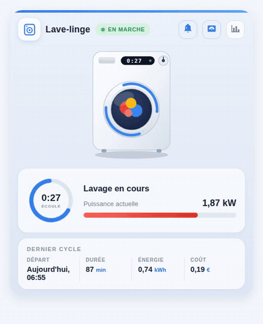

# 🧺 Carte animée de lave-linge pour Home Assistant

[English](README.md) | [Русский](README_RU.md) | [Deutsch](README_DE.md) | **Français**

Une carte Lovelace inspirée d'Oikos qui transforme un lave-linge *ordinaire* branché sur une prise connectée en un joli widget animé — sans avoir besoin d'un lave-linge connecté.



<sub>Démo dans d'autres langues d'interface : [English](media/demo_en.gif) · [Русский](media/demo.gif) · [Deutsch](media/demo_de.gif)</sub>

## ✨ Fonctionnalités

- **Machine animée** — pendant un cycle, le linge culbute derrière le hublot, des arcs bleus tournent autour de la porte (un tour toutes les 3 s) et l'afficheur de la machine indique le temps écoulé. Toute l'animation est en CSS/SVG pur, sans fichier externe, et respecte `prefers-reduced-motion`.
- **État en direct** — un badge clignotant « EN MARCHE / INACTIF », un anneau de progression avec le temps écoulé et une jauge de puissance qui choisit son unité toute seule (`1950 W` s'affiche `1,95 kW` ; avec un capteur de courant, le libellé devient automatiquement « Courant instantané »).
- **Résumé du dernier cycle** — heure de départ (« Aujourd'hui, 09:55 »), durée, énergie et coût ; chaque colonne ouvre la fenêtre more-info d'une simple pression.
- **Actions rapides** — les boutons de l'en-tête commutent la prise connectée et l'automatisation de notification de fin, et ouvrent l'historique de puissance.
- **Quatre langues** — français, anglais, russe et allemand d'origine. La langue suit votre profil Home Assistant, ou se force avec `language: fr | en | ru | de`.
- **Aucune dépendance** — un seul fichier JavaScript natif avec Shadow DOM. Toutes les options d'entité sauf `status_entity` sont facultatives : les blocs sans entité sont simplement masqués. Responsive grâce aux CSS container queries.

## 📦 Installation

### Manuelle

1. Copiez [`washing-machine-card.js`](washing-machine-card.js) dans `/config/www/`.
2. Ajoutez une ressource au tableau de bord (Paramètres → Tableaux de bord → Ressources, ou `lovelace: resources:` en mode YAML) :

   ```yaml
   url: /local/washing-machine-card.js?v=1
   type: module
   ```

   Incrémentez `?v=` après chaque mise à jour pour vider le cache du navigateur.

### HACS

Ajoutez `https://github.com/sionetta/wm_animated_ha_card` comme **dépôt personnalisé** (type : Dashboard), puis installez *Washing Machine Animated Card*.

## ⚙️ Configuration

```yaml
type: custom:washing-machine-card
name: Lave-linge
status_entity: binary_sensor.washing_in_progress   # OBLIGATOIRE
plug_entity: switch.washing_machine_plug           # bouton prise, appui = commuter
notify_entity: automation.washing_finished         # bouton notification, appui = commuter
power_entity: sensor.washing_machine_power         # jauge + détection de marche
power_threshold: 10                                # au-dessus, la machine est en marche
power_max: 2500                                    # maximum de la jauge
last_wash_entity: input_datetime.wm_last_start     # horodatage du début de cycle
duration_entity: input_number.wm_last_duration     # durée du cycle, en minutes
energy_entity: input_number.wm_last_energy         # kWh par cycle
cost_entity: input_number.wm_last_cost             # coût par cycle
currency: "€"
language: fr                                       # fr / en / ru / de (défaut : langue de HA)
```

| Option | Obligatoire | Défaut | Description |
|---|---|---|---|
| `status_entity` | **oui** | — | Entité dont l'état signale un cycle en cours. Un `binary_sensor` template sur la puissance ou le courant de la prise convient parfaitement ; les états textuels (`lavage`, `essorage`, …) sont reconnus via `running_states`. |
| `name` | non | localisé | Titre de la carte. |
| `plug_entity` | non | — | Interrupteur de la prise connectée ; affiché comme bouton dans l'en-tête, l'appui le commute. |
| `notify_entity` | non | — | Automatisation / switch / input_boolean de la notification « cycle terminé » ; l'appui la commute. |
| `power_entity` | non | — | Capteur de puissance (W) ou de courant (A) : jauge rouge, affichage de la valeur et seconde détection de marche. |
| `power_threshold` | non | `10` | Au-dessus de cette valeur, la machine est considérée en marche. |
| `power_max` | non | `2500` | Maximum de la jauge, dans l'unité de `power_entity`. |
| `last_wash_entity` | non | — | `input_datetime` contenant le début du cycle ; sert aussi à calculer le temps écoulé. |
| `duration_entity` | non | — | Durée du dernier cycle, en minutes. |
| `energy_entity` | non | — | Énergie par cycle, en kWh. |
| `cost_entity` | non | — | Coût par cycle. |
| `currency` | non | `€` | Symbole monétaire de la colonne coût. |
| `running_states` | non | on, washing, lavage, run, essorage, … | États de `status_entity` considérés comme « en marche ». |
| `language` | non | langue de HA | `fr`, `en`, `ru` ou `de`. |

## 🧠 Comment ça marche avec une machine ordinaire

La machine elle-même ne remonte rien : tout est déduit d'une prise connectée avec mesure de puissance.

- un `binary_sensor` template (puissance au-dessus d'un seuil, avec un `delay_off` de quelques minutes pour que les pauses en milieu de cycle ne comptent pas comme une fin) fournit l'état ;
- une petite automatisation enregistre le début du cycle dans un `input_datetime`, puis écrit à la fin la durée, l'énergie et le coût dans des helpers `input_number` que la carte affiche dans le bloc « Dernier cycle ».

Un package Home Assistant prêt à l'emploi avec ces capteurs, helpers et automatisations se trouve dans [`examples/washing_machine_package.yaml`](examples/washing_machine_package.yaml).

## 🔌 Utilisation avec une machine connectée

Si votre lave-linge ou sèche-linge remonte déjà son propre état, ni la prise ni les
helpers ne sont nécessaires. Home Connect (Bosch / Siemens / Neff / Gaggenau),
Miele@home, LG ThinQ et SmartHQ exposent tous une entité d'état de fonctionnement,
si bien que `status_entity` peut pointer directement dessus :

```yaml
type: custom:washing-machine-card
name: Lave-linge
status_entity: sensor.washer_operation_state
plug_entity: switch.washer_power
running_states: [run]
```

Pour un sèche-linge, la configuration est identique, seul le préfixe change.
Restreignez `running_states` au seul état qui signifie vraiment « en marche », sinon
un appareil en pause ou allumé mais inactif sera compté comme en marche.

[`examples/smart_appliance.yaml`](examples/smart_appliance.yaml) contient la version
complète, avec la progression, l'heure de fin et l'état de la porte pour lesquels la
carte n'a pas d'options dédiées, ainsi que des notes sur ce qui reste vide et pourquoi.

## 📄 Licence

[MIT](LICENSE) © 2026 [sionetta](https://github.com/sionetta)
