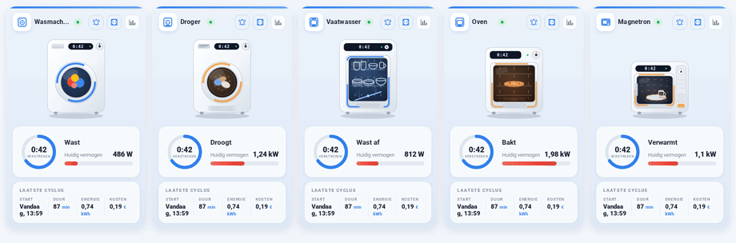
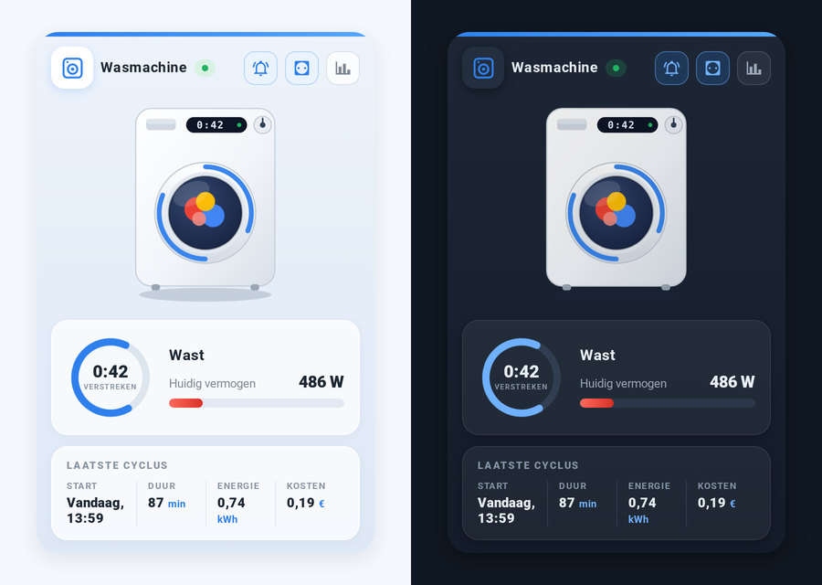

# 🏠 Geanimeerde Apparaatkaart voor Home Assistant

[English](README.md) | [Русский](README_RU.md) | [Deutsch](README_DE.md) | [Français](README_FR.md) | **Nederlands**

Een op Oikos geïnspireerde Lovelace-kaart die een *domme* wasmachine, droger, vaatwasser, oven of magnetron op een smart plug omtovert tot een prachtige, geanimeerde dashboardwidget — geen slim apparaat nodig.



<sub>Dezelfde kaart in andere UI-talen: [English](media/demo_en.gif) · [Русский](media/demo_ru.gif) · [Deutsch](media/demo_de.gif) · [Français](media/demo_fr.gif)</sub>

## ✨ Functies

- **Vijf apparaten, één kaart** — `washer`, `dryer`, `dishwasher`, `oven` en `microwave`, elk met een eigen illustratie, icoon en bewoording. Wisselen met één regel: `appliance_type: dryer`.
- **Geanimeerd tijdens gebruik** — de was tuimelt achter het glas, de sproeiers van de vaatwasser bewegen, de oven gloeit, het draaiplateau van de magnetron draait. Alle animatie is pure CSS/SVG, zonder externe bestanden, en houdt rekening met `prefers-reduced-motion`.
- **Licht en donker thema** — de kaart volgt automatisch je Home Assistant-thema, of je zet 'm vast met `theme: light | dark`. Een vierde waarde, `theme: ha`, laat het eigen kleurenpalet van de kaart los en gebruikt de kleuren van je actieve Home Assistant-thema.
- **Live status** — een pulserend "BEZIG / INACTIEF"-badge, een ring met verstreken tijd en een vermogensmeter met automatische eenheidsafhandeling (`1950 W` wordt getoond als `1,95 kW`; een sensor in ampère krijgt automatisch het label "Huidig verbruik").
- **Samenvatting laatste cyclus** — starttijd ("Vandaag, 09:55"), duur, energie en kosten, elke kolom aantikbaar voor meer info.
- **Snelle acties** — knoppen in de header schakelen de smart plug en de meldingsautomatisering, en openen de vermogensgeschiedenis.
- **Vijf talen** — Nederlandse, Engelse, Russische, Duitse en Franse labels standaard aanwezig. De taal volgt je Home Assistant-profiel, of stel `language: nl | en | ru | de | fr` expliciet in.
- **Visuele editor** — de kaart heeft een configuratieformulier, dus je kunt 'm via de UI instellen zonder YAML aan te raken.
- **Geen afhankelijkheden** — één vanilla-JS-bestand met Shadow DOM. Elke entiteitsoptie behalve `status_entity` is optioneel: blokken zonder entiteit worden gewoon verborgen. Past zich aan de breedte aan, van een volledige dashboardkolom tot een smalle weergave op een telefoon.

## 🌗 Licht en donker



`theme: auto` (de standaard) volgt Home Assistant: zet je dashboard op een donker thema en de kaart volgt bij de volgende weergave. `theme: light` en `theme: dark` zetten het thema vast, ongeacht het dashboard. `theme: ha` werkt anders: in plaats van het eigen kleurenpalet van de kaart worden de kleuren van het actieve Home Assistant-thema overgenomen, zodat de kaart opgaat in een aangepast thema.

## 📦 Installatie

Twee stappen: eerst de kaart zelf, dan de entiteiten die hij toont.

### Stap 1 — de kaart

**Handmatig**

1. Kopieer [`washing-machine-card.js`](washing-machine-card.js) naar `/config/www/`.
2. Voeg een dashboardresource toe (Instellingen → Dashboards → Bronnen, of `lovelace: resources:` in YAML-modus):

   ```yaml
   url: /local/washing-machine-card.js?v=6
   type: module
   ```

   Verhoog `?v=` na elke update om de browsercache te omzeilen.

**HACS**

Voeg `https://github.com/sionetta/wm_animated_ha_card` toe als **aangepaste repository** (type: Dashboard), en installeer daarna *Washing Machine Animated Card*.

### Stap 2 — de apparaatentiteiten

De kaart toont alleen data, en `status_entity` is verplicht, dus deze stap kan niet worden overgeslagen.

**Een slim apparaat** (Home Connect, Miele@home, LG ThinQ, SmartHQ) rapporteert al zijn eigen status — ga direct naar "Gebruik met een slim apparaat" hieronder.

**Een gewoon apparaat op een smart plug** — het kant-en-klare pakket maakt alles aan:

1. Zoek de sensoren van je stekker op in Ontwikkelaarstools → States: vermogen (W) en cumulatieve energie (kWh), bijv. `sensor.washer_plug_power` en `sensor.washer_plug_energy`.

2. Schakel packages in binnen `configuration.yaml` (als er al een `homeassistant:`-blok bestaat, voeg de regel daaraan toe):

   ```yaml
   homeassistant:
     packages: !include_dir_named packages
   ```

3. Kopieer [`examples/washing_machine_package.yaml`](examples/washing_machine_package.yaml) naar `/config/packages/washing_machine.yaml`.

4. Vervang daarin `sensor.YOUR_PLUG_power` en `sensor.YOUR_PLUG_energy` door je eigen sensoren.

5. Herstart Home Assistant.

6. Stel je elektriciteitsprijs in bij `input_number.el_tarif` — deze staat standaard op nul, en zonder tarief zijn de cycluskosten altijd `0.00`.

7. Controleer of de entiteiten zijn verschenen:

   | Entiteit | Doel |
   |---|---|
   | `binary_sensor.washing_in_progress` | voor `status_entity` |
   | `input_datetime.wm_last_start` | start van de cyclus |
   | `input_number.wm_last_duration` | duur |
   | `input_number.wm_last_energy` | energie |
   | `input_number.wm_last_cost` | kosten |
   | `input_number.el_tarif` | je tarief (stap 6) |
   | `input_number.wm_energy_start` | intern |

8. Voeg de kaart toe aan je dashboard — zie "Configuratie" hieronder.

> De melding komt binnen als `persistent_notification`. Voor je telefoon vervang je het laatste blok van de automatisering door je eigen `notify.mobile_app_...`.
>
> Voor een droger, vaatwasser, oven of magnetron kopieer je het pakket onder een andere naam met andere entiteitsprefixen, en stel je de bijbehorende `appliance_type` op de kaart in.
>
> Zonder packages: dezelfde helpers kunnen ook in de Home Assistant-UI worden aangemaakt, en de automatiseringen kunnen in de automatiseringseditor worden geplakt (⋮ → Bewerken in YAML).

## ⚙️ Configuratie

```yaml
type: custom:washing-machine-card
appliance_type: washer                             # washer | dryer | dishwasher | oven | microwave
name: Wasmachine
status_entity: binary_sensor.washing_in_progress   # VERPLICHT
plug_entity: switch.washing_machine_plug           # stekkerknop, tikken = schakelen
notify_entity: automation.washing_finished         # meldingsknop, tikken = schakelen
power_entity: sensor.washing_machine_power         # meter + detectie van draaien
power_threshold: 10                                # loopt boven deze waarde
power_max: 2500                                    # maximum van de meter
last_wash_entity: input_datetime.wm_last_start     # tijdstempel start cyclus
duration_entity: input_number.wm_last_duration     # duur cyclus, minuten
energy_entity: input_number.wm_last_energy         # kWh per cyclus
cost_entity: input_number.wm_last_cost             # kosten per cyclus
hide_status_panel: true                            # verbergt het statuspaneel zolang het apparaat inactief is (standaard: false)
show_raw_status: false                             # Toont de ruwe waarde van de statusentiteit in het statuspaneel van de kaart (standaard: false)
duration_format: minutes                           # minutes / hhmm
confirm_plug_off: true                             # toont een bevestigingspopup voordat `plug_entity` wordt uitgeschakeld
currency: "€"
language: nl                                       # auto / nl / en / ru / de / fr (auto = volgt Home Assistant)
theme: auto                                        # auto / light / dark / ha
```

| Optie | Verplicht | Standaard | Beschrijving |
|---|---|---|---|
| `status_entity` | **ja** | — | Entiteit waarvan de status een lopende cyclus aangeeft. Een sjabloon-`binary_sensor` op het vermogen/de stroom van de stekker werkt uitstekend; tekstuele statussen (`washing`, `spin`, …) worden herkend via `running_states`. |
| `appliance_type` | nee | `washer` | Weergave + labels: `washer`, `dryer` (alias `tumbler`), `dishwasher`, `oven` of `microwave`. |
| `name` | nee | gelokaliseerd | Titel van de kaart (standaardwaarden hangen af van `appliance_type`). |
| `plug_entity` | nee | — | Smart-plug-schakelaar; getoond als knop in de header, tikken schakelt hem. |
| `notify_entity` | nee | — | Automatisering/schakelaar/input_boolean voor de melding "cyclus voltooid"; tikken schakelt hem. |
| `power_entity` | nee | — | Vermogen- (W) of stroomsensor (A): rode meter, waardeweergave, en hij onderscheidt een lopende cyclus van een gepauzeerde — zie `power_threshold`. |
| `power_threshold` | nee | `10` | Met een `power_entity` wordt een lopende cyclus die minder dan deze waarde verbruikt weergegeven als **gepauzeerd** in plaats van lopend. Zonder die sensor ziet de kaart het verschil niet en beslist alleen `status_entity`. |
| `power_max` | nee | `2500` | Maximum van de meter, in de eenheid van `power_entity`. |
| `last_wash_entity` | nee | — | `input_datetime` met de start van de cyclus; ook de bron van de verstreken tijd. |
| `duration_entity` | nee | — | Duur van de laatste cyclus in minuten. |
| `energy_entity` | nee | — | Energie per cyclus, kWh. |
| `cost_entity` | nee | — | Kosten per cyclus. |
| `currency` | nee | `€` | Valutasymbool voor de kostenkolom. |
| `running_states` | nee | on, washing, wassen, run, centrifugeren, … | Statussen van `status_entity` die als "loopt" worden beschouwd (Nederlandse, Engelse, Russische, Duitse en Franse statussen worden herkend). |
| `hide_status_panel` | nee | false | Verbergt het statuspaneel zolang het apparaat inactief is, en toont het weer zodra een cyclus start. |
| `show_raw_status` | nee | false | Toont de ruwe waarde van `status_entity` in het statuspaneel van de kaart. Dit is handig wanneer een slim apparaat zijn status rechtstreeks doorstuurt. De status moet nog steeds overeenkomen met een van de waarden die zijn gedefinieerd in `running_states`.|
| `duration_format` | nee | minutes | `minutes`, `hhmm`. Bepaalt de opmaak van de duur van de laatste cyclus. Als `duration_format` op `hhmm` staat en de duur 60 minuten of langer is, wordt de waarde weergegeven in HHhMM-formaat (bijvoorbeeld 1h05). |
| `confirm_plug_off` | nee | true | Toont een bevestigingspopup voordat `plug_entity` wordt uitgeschakeld. |
| `language` | nee | `auto` | `auto`, `nl`, `en`, `ru`, `de` of `fr`. |
| `theme` | nee | `auto` | `auto`, `light` en `dark` gebruiken de eigen styling van de kaart. `ha` neemt in plaats daarvan de kleuren van je Home Assistant-thema over. |

## 🧺 Apparaattypen

| `appliance_type` | Standaardtitel | Label tijdens gebruik |
|---|---|---|
| `washer` | Wasmachine | Wast |
| `dryer` (alias `tumbler`) | Droger | Droogt |
| `dishwasher` | Vaatwasser | Wast af |
| `oven` | Oven | Bakt |
| `microwave` | Magnetron | Verwarmt |

Titels en labels zijn vertaald naar alle vijf de talen; `name` overschrijft de titel.

## 🧠 Hoe het werkt met een dom apparaat

Het apparaat zelf rapporteert niets — alles wordt afgeleid van een smart plug met vermogensmeting:

- een sjabloon-`binary_sensor` (vermogen boven een drempel, met `delay_off` van een paar minuten zodat pauzes tussen cycli niet als "klaar" tellen) stuurt de status aan;
- een kleine automatisering slaat de start van de cyclus op in `input_datetime`, en schrijft bij het einde duur, energie en kosten weg naar `input_number`-helpers, die de kaart toont in het paneel "Laatste cyclus".

Het kant-en-klare pakket dat dit allemaal aanmaakt, wordt geïnstalleerd in stap 2 hierboven.

## 🔌 Gebruik met een slim apparaat

Als je apparaat al zijn eigen status rapporteert, heb je de stekker of een van de
helpers niet nodig. Home Connect (Bosch / Siemens / Neff / Gaggenau), Miele@home, LG ThinQ en
SmartHQ hebben allemaal een entiteit voor de bedrijfsstatus, dus `status_entity` kan daar direct naar wijzen:

```yaml
type: custom:washing-machine-card
appliance_type: washer
status_entity: sensor.washer_operation_state
plug_entity: switch.washer_power
running_states: [run]
show_raw_status: true
```

Een droger, vaatwasser, oven of magnetron gebruikt dezelfde configuratie met een andere
`appliance_type` en entiteitsprefix. Beperk `running_states` tot de ene status die
echt "loopt" betekent, anders wordt een gepauzeerd of ingeschakeld-maar-inactief apparaat als lopend gelezen.

[`examples/smart_appliance.yaml`](examples/smart_appliance.yaml) bevat de volledige versie,
inclusief de voortgangs-, eindtijd- en deurwaarden waarvoor de kaart geen opties heeft, plus
notities over wat leeg blijft en waarom.

## 📝 Changelog

Zie [CHANGELOG.md](CHANGELOG.md) voor de release-geschiedenis.

## 📄 Licentie

[MIT](LICENSE) © 2026 [sionetta](https://github.com/sionetta)
