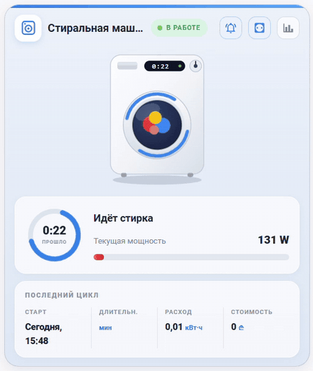

# 🧺 Анимированная карточка стиральной машины для Home Assistant

[English](README.md) | **Русский** | [Deutsch](README_DE.md) | [Français](README_FR.md)

Lovelace-карточка в стиле Oikos, которая превращает обычную «глупую» стиральную машину на умной розетке в красивый анимированный виджет — умная стиралка не нужна.



<sub>Демо на других языках интерфейса: [English](media/demo_en.gif) · [Deutsch](media/demo_de.gif) · [Français](media/demo_fr.gif)</sub>

## ✨ Возможности

- **Анимированная машинка** — во время стирки бельё кувыркается за стеклом, вокруг дверцы вращаются синие дуги (оборот за 3 секунды), а дисплей на корпусе показывает прошедшее время. Вся анимация — чистый CSS/SVG, без внешних ресурсов, с уважением к `prefers-reduced-motion`.
- **Живой статус** — пульсирующий бейдж «В РАБОТЕ / ОЖИДАНИЕ», кольцо с прошедшим временем цикла и шкала мощности с автоматикой единиц (`1950 Вт` показывается как `1,95 кВт`, а для датчика тока подпись сама меняется на «Текущий ток»).
- **Итоги последнего цикла** — старт («Сегодня, 09:55»), длительность, расход и стоимость; каждая колонка открывает more-info по тапу.
- **Быстрые действия** — кнопки в шапке переключают умную розетку и автоматизацию уведомления об окончании, а также открывают историю мощности.
- **Четыре языка** — русский, английский, немецкий и французский из коробки. Язык берётся из профиля Home Assistant или задаётся явно: `language: ru | en | de | fr`.
- **Без зависимостей** — один файл на чистом JS с Shadow DOM. Все entity-параметры, кроме `status_entity`, необязательны: блоки без сущности просто скрываются. Адаптивность через CSS container queries.

## 📦 Установка

### Вручную

1. Скопируйте [`washing-machine-card.js`](washing-machine-card.js) в `/config/www/`.
2. Добавьте ресурс панели (Настройки → Панели → Ресурсы, либо `lovelace: resources:` в yaml-режиме):

   ```yaml
   url: /local/washing-machine-card.js?v=1
   type: module
   ```

   После каждого обновления файла увеличивайте `?v=`, чтобы сбросить кэш браузера.

### HACS

Добавьте `https://github.com/sionetta/wm_animated_ha_card` как **пользовательский репозиторий** (тип: Dashboard) и установите *Washing Machine Animated Card*.

## ⚙️ Конфигурация

```yaml
type: custom:washing-machine-card
name: Стиральная машина
status_entity: binary_sensor.washing_in_progress   # ОБЯЗАТЕЛЬНЫЙ
plug_entity: switch.washing_machine_plug           # кнопка «Розетка», тап = переключить
notify_entity: automation.washing_finished         # кнопка «Уведомление», тап = переключить
power_entity: sensor.washing_machine_power         # шкала + детект работы
power_threshold: 10                                # выше этого значения машина работает
power_max: 2500                                    # максимум шкалы
last_wash_entity: input_datetime.wm_last_start     # время старта цикла
duration_entity: input_number.wm_last_duration     # длительность цикла, мин
energy_entity: input_number.wm_last_energy         # кВт·ч за цикл
cost_entity: input_number.wm_last_cost             # стоимость цикла
currency: "₾"
language: ru                                       # ru / en / de / fr (по умолчанию — язык HA)
```

| Параметр | Обязателен | По умолчанию | Описание |
|---|---|---|---|
| `status_entity` | **да** | — | Сущность, состояние которой означает работающий цикл. Отлично подходит шаблонный `binary_sensor` по мощности или току розетки; текстовые состояния (`washing`, `отжим`, …) сопоставляются через `running_states`. |
| `name` | нет | по языку | Название карточки. |
| `plug_entity` | нет | — | Выключатель умной розетки; показывается кнопкой в шапке, тап переключает. |
| `notify_entity` | нет | — | Автоматизация / switch / input_boolean уведомления об окончании цикла; тап переключает. |
| `power_entity` | нет | — | Датчик мощности (Вт) или тока (А): красная шкала, отображение значения и второй детектор «работает». |
| `power_threshold` | нет | `10` | Выше этого значения машина считается работающей. |
| `power_max` | нет | `2500` | Максимум шкалы, в единицах `power_entity`. |
| `last_wash_entity` | нет | — | `input_datetime` со временем старта цикла; из него же считается прошедшее время. |
| `duration_entity` | нет | — | Длительность последнего цикла в минутах. |
| `energy_entity` | нет | — | Энергия за цикл, кВт·ч. |
| `cost_entity` | нет | — | Стоимость цикла. |
| `currency` | нет | `€` | Символ валюты для колонки стоимости. |
| `running_states` | нет | on, washing, стирка, run, spin, … | Состояния `status_entity`, считающиеся «работает» (распознаются русские, английские, немецкие и французские). |
| `language` | нет | язык HA | `ru`, `en`, `de` или `fr`. |

## 🧠 Как это работает с «глупой» машиной

Сама машина ничего не сообщает — всё выводится из умной розетки с измерением мощности:

- шаблонный `binary_sensor` (мощность выше порога, с `delay_off` в несколько минут, чтобы паузы внутри цикла не считались окончанием) даёт статус;
- небольшая автоматизация записывает старт цикла в `input_datetime`, а по окончании — длительность, расход и стоимость в хелперы `input_number`, которые карточка показывает в блоке «Последний цикл».

Готовый пример пакета Home Assistant с этими сенсорами, хелперами и автоматизациями — в [`examples/washing_machine_package.yaml`](examples/washing_machine_package.yaml).

## 🔌 Использование с «умной» машиной

Если ваша стиральная или сушильная машина сама сообщает своё состояние, ни розетка,
ни хелперы не нужны. Home Connect (Bosch / Siemens / Neff / Gaggenau), Miele@home,
LG ThinQ и SmartHQ дают сущность состояния операции, поэтому `status_entity` может
указывать прямо на неё:

```yaml
type: custom:washing-machine-card
name: Стиральная машина
status_entity: sensor.washer_operation_state
plug_entity: switch.washer_power
running_states: [run]
```

Для сушильной машины конфигурация та же, меняется только префикс. Сузьте
`running_states` до одного состояния, которое действительно означает «работает»,
иначе машина на паузе или просто включённая, но простаивающая, будет считаться
работающей.

В [`examples/smart_appliance.yaml`](examples/smart_appliance.yaml) — полная версия,
включая прогресс, время окончания и состояние дверцы, для которых у карточки нет
отдельных параметров, а также пояснения, какие блоки останутся пустыми и почему.

## 📄 Лицензия

[MIT](LICENSE) © 2026 [sionetta](https://github.com/sionetta)
